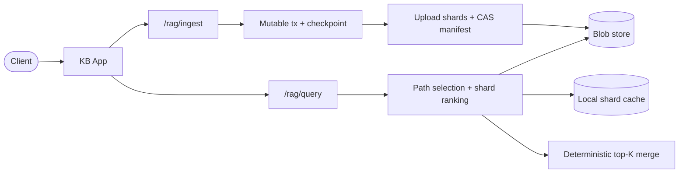
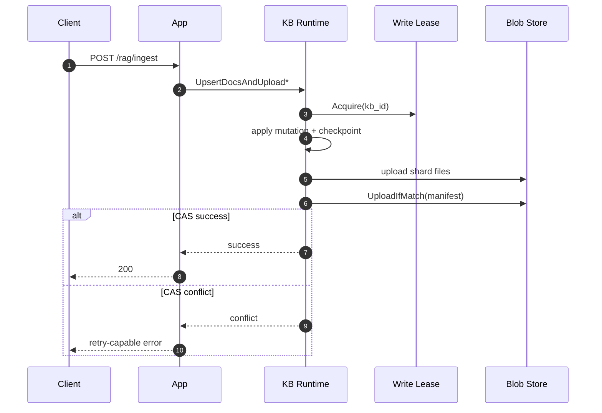
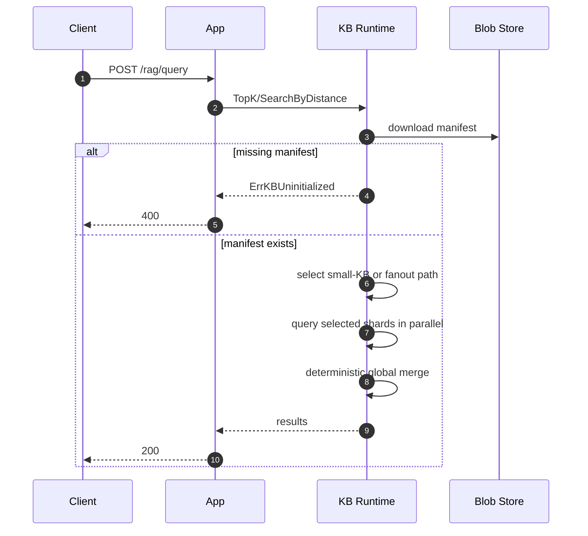

# KB Core Docs Overview

Please use this README as an entry point, then jump to the detailed docs:

- Architecture details: `docs/architecture.md`
- Data model and lifecycle: `docs/data-lifecycle.md`
- Local setup and runtime config: `docs/getting-started.md`

## TL;DR

- Storage is shard-only: manifest + immutable shard DuckDB files.
- Writes use per-KB lease + manifest CAS (`UploadIfMatch`) to prevent lost updates.
- Queries read manifest, choose small-KB full scan or centroid-ranked fanout, then merge deterministically.
- Cache is pod-local and protected by TTL + size budget eviction.
- Graph query mode is strict: if knowledge graph data is unavailable, request fails.

## End-to-End Flow



## Write Path (Ingest)



## Query Path



## Quick Run

```bash
go test ./... -count=1
go run .
curl -s http://127.0.0.1:8080/healthz
```
