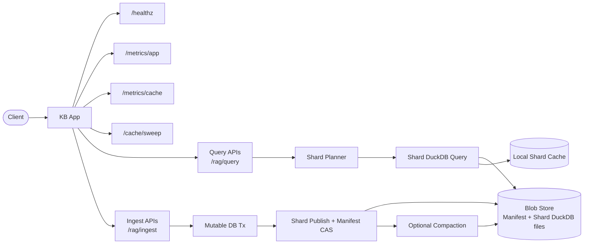
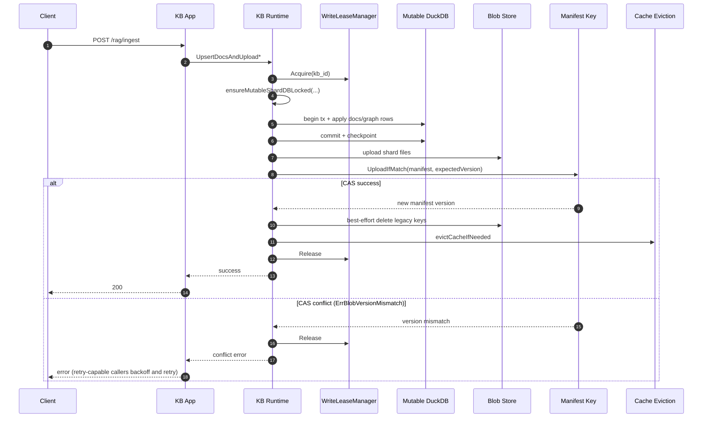
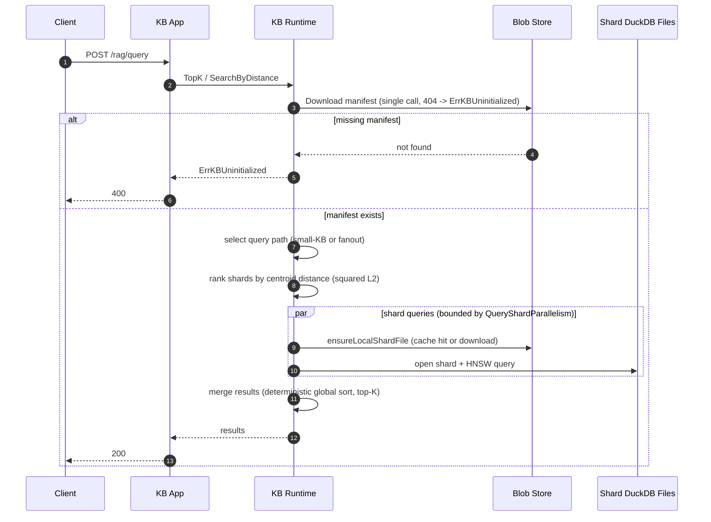
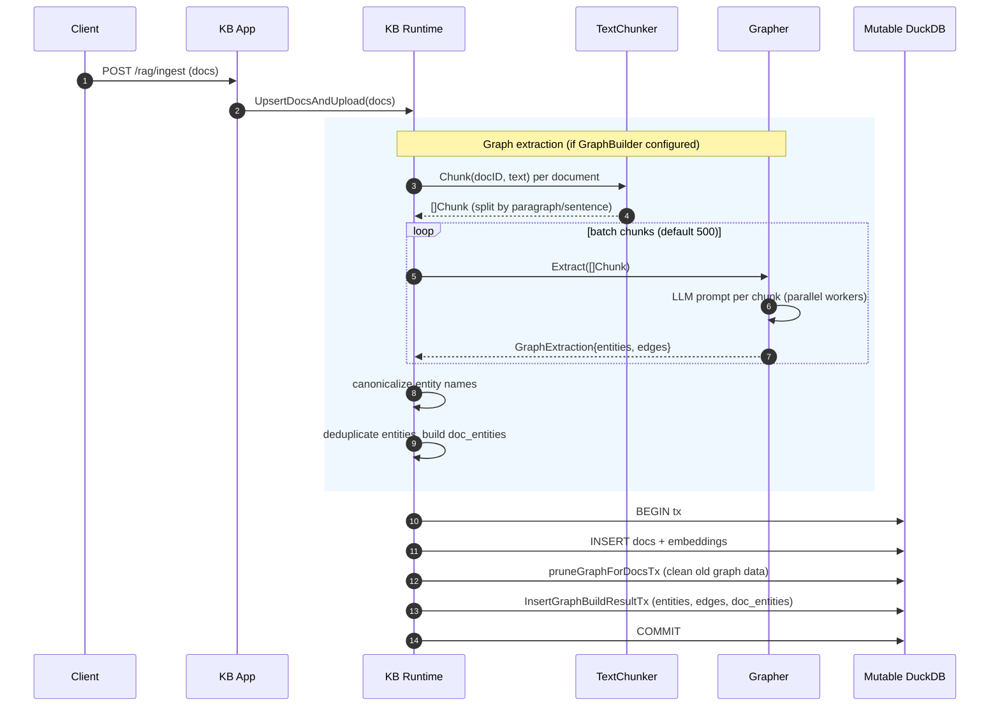

# Architecture

## Flow Diagram

## Write Sequence

## Query Sequence

## Graph Extraction

During ingestion, documents are optionally processed through a graph extraction
pipeline that produces entities, edges, and doc-entity mappings. This data powers
graph-expanded retrieval at query time.

### Graph Schema

| Table | Columns | Purpose |
|---|---|---|
| `entities` | `id` (PK), `name` | Canonical entity registry |
| `edges` | `src`, `dst`, `weight`, `rel_type`, `chunk_id` | Directed relationships between entities |
| `doc_entities` | `doc_id`, `entity_id`, `weight`, `chunk_id` | Links documents to entities via chunks |

### Pipeline Stages

1. **Chunking** — `TextChunker` splits document text using a separator hierarchy
   (`\n\n` → `\n` → `.` → ` ` → chars) with a default chunk size of 500 bytes.
2. **Extraction** — `Grapher.Extract()` sends chunks to an LLM (Ollama) which
   returns entity names and `{src, dst, rel, weight}` edges as JSON.
3. **Canonicalization** — Optional `Canonicalizer` maps raw entity names to
   stable IDs. If not configured, raw names are used as-is.
4. **Storage** — Entities inserted with `INSERT OR IGNORE`, edges with weight
   normalization (<=0 becomes 1.0), doc_entities derived from edge chunk_ids
   mapped back to doc_ids.

## Concurrency Model

Two layers work together to prevent lost updates:

| Layer | Mechanism | Scope |
|---|---|---|
| Coarse | Write lease (`WriteLeaseManager`) | Per KB ID, cluster-wide |
| Fine | CAS on manifest (`UploadIfMatch`) | Atomic blob swap |

**Write lease** prevents most concurrent write attempts from running simultaneously.
Only one writer holds a lease for a given KB at a time. Lease acquisition fails fast
with `ErrWriteLeaseConflict`.

**CAS (`UploadIfMatch`)** is the safety net. The writer reads the current manifest
version before doing work, then passes that version to `UploadIfMatch`. If another
writer published in between, the store returns `ErrBlobVersionMismatch` and the
operation aborts. Retry-capable callers (`UpsertDocsAndUploadWithRetry`) re-read
and re-run with quadratic backoff.

Shard files are immutable and content-addressed (`<kb_id>.duckdb.shards/<hash>/…`),
so concurrent uploads of the same shard are idempotent. A writer that loses the CAS
race has uploaded shard files that are simply orphaned and collected on the next GC pass.

## Shard Query Path Selection

`resolveVectorQuerySelection` chooses one of two paths after downloading the manifest:

- **Small KB** (`shards ≤ SmallKBMaxShards`, default 2): all shards queried. Centroid
  ranking skipped — overhead not worth it for a handful of shards.
- **Large KB** (fanout path): shards ranked by squared Euclidean distance from the
  query vector to each shard's centroid. Only the top `QueryShardFanout` shards
  (default 4, capped by `QueryShardFanoutAdaptiveMax`) are downloaded and queried.
  Shards without centroids fall back to ranking by descending `VectorRows`.

Scores are precomputed once before the sort (O(n)), not inside the comparator (O(n log n)).
Squared distance is used for ordering — `math.Sqrt` is not needed and was removed.

## High-Level Components

- App server (`/cmd/app.go`, `/cmd/actions.go`, `/cmd/ui.go`)
  - HTTP routing, request validation, per-request mode handling, and error mapping.
- Runtime metrics (`/kb/app_metrics.go`, `/kb/sharding_metrics.go`)
  - app-level request/ingest/query counters, cache metrics, and shard execution metrics.
- KB orchestrator (`/kb/kb.go`, `/kb/errors.go`, `/kb/helpers.go`)
  - central orchestration for load, mutation, shard publish, query planning, and cache eviction.
- Embedding providers (`/kb/ollama.go`, `/kb/local_embedder.go`)
  - Ollama-backed embedder (HTTP API) and local subword n-gram embedder (pure Go, no external deps).
- Blob store abstraction (`/kb/store_blob.go`)
  - CAS-protected publish (`UploadIfMatch`) and object lifecycle.
- Local/S3 blob implementations (`/kb/store_blob_local.go`, `/kb/store_blob_s3.go`)
  - filesystem or S3 storage backends behind one interface.
- Write coordination (`/kb/store_lease.go`, `/kb/store_lease_memory.go`, `/kb/store_lease_redis.go`)
  - per-KB lease acquisition to reduce duplicate distributed write work.
- Sharded snapshot runtime (`/kb/snapshot_sharded.go`, `/kb/shard_mutable.go`)
  - shard-file generation, manifest publish/download, mutable DB bootstrap from manifest.
- Sharding policy (`/kb/sharding_policy.go`)
  - configurable thresholds for shard triggers, fanout, compaction, and query parallelism.
- Mutation pipeline (`/kb/mutation_upsert.go`, `/kb/mutation_delete.go`, `/kb/mutation_retry.go`)
  - transactional writes, checkpoint, publish, CAS conflict retry with quadratic backoff, and legacy-key cleanup.
- Vector query planner/executor (`/kb/query_vector.go`)
  - small-KB full-shard path, centroid-ranked fanout path, parallel shard execution, deterministic global merge.
- Graph query engine (`/kb/query_graph.go`, `/kb/query_graph_pgq.go`)
  - vector/graph/adaptive retrieval over shard-local graph tables with strict unavailable semantics.
- Graph extraction and storage (`/kb/graph_pipeline.go`, `/kb/graph_store.go`, `/kb/text_chunker.go`, `/kb/ollama.go`)
  - ingestion-time chunk/entity/edge extraction and persistence.
- Compaction and GC (`/kb/compaction.go`, `/kb/shard_gc.go`)
  - shard merge/replacement with manifest CAS and delayed object GC.
- Cache eviction (`/kb/cache_eviction.go`)
  - TTL-based and size-budget eviction over local cache directories; typed eviction counters per reason.

## Data Model

Persisted per KB:

- `<kb_id>.duckdb.manifest.json`
- `<kb_id>.duckdb.shards/<content-hash>/shard-xxxxx.duckdb`

Shard DB tables:

- `docs`
- `entities`
- `edges`
- `doc_entities`

## Query Behavior

- No monolith fallback.
- Missing manifest → `ErrKBUninitialized`.
- Manifest download is a single `Download` call; a 404 is mapped to `ErrKBUninitialized` directly.
- `search_mode=graph` is strict and returns `ErrGraphQueryUnavailable` when graph data is absent.

## Mutation Behavior

- Writes apply to local mutable state then publish shards + manifest CAS.
- Legacy object cleanup (`<kb_id>.duckdb`, `<kb_id>.snapshot.json`) is best-effort after successful shard publish.
- Retry-capable APIs re-run on CAS conflict with quadratic backoff (`attempt² × 10ms`).

## Cache Model

- Cache is per-pod local filesystem.
- Eviction uses TTL and size budget; both can be active simultaneously.
- On cache hit, `os.MkdirAll` is skipped — directory creation only happens on a cache miss.
- `ErrCacheBudgetExceeded` is returned when budget cannot be satisfied within the retry window.
